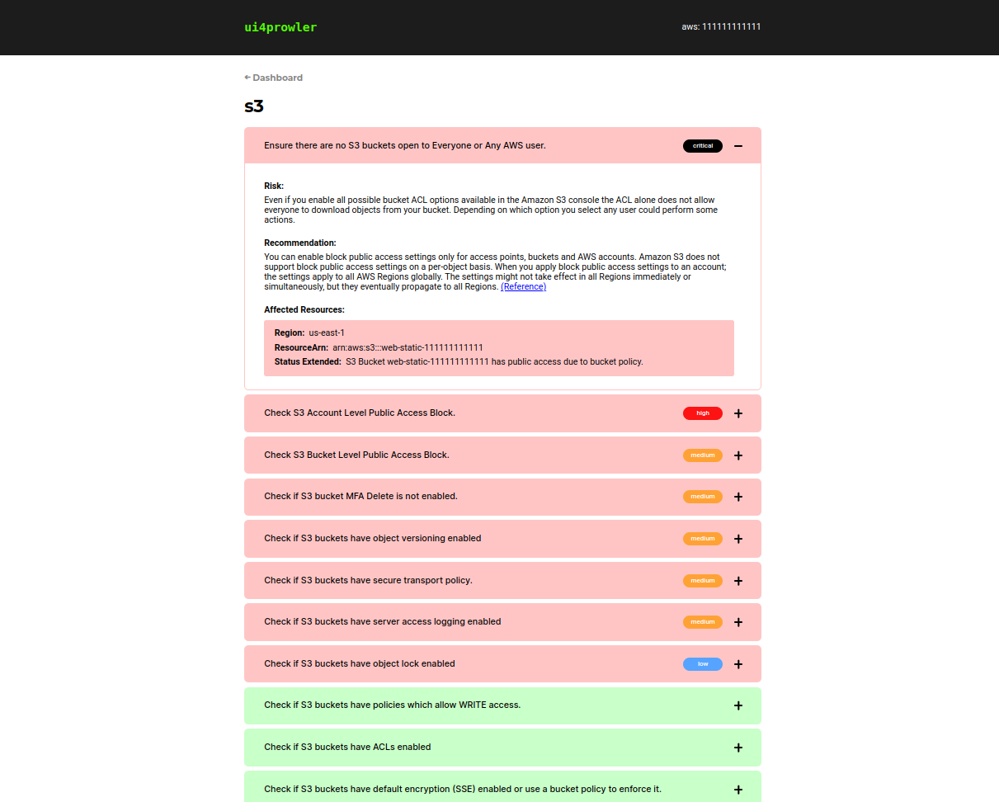

# ui4prowler



## Overview

The ui4prowler is a visulation tool that makes it easier and more effective to read and interpret the security reports generated by [Prowler](https://github.com/prowler-cloud/prowler).

## Installation

Python >= 3.9 is required with pip:
```bash
git clone https://github.com/Dmytro-Mykhalko/ui4prowler.git
cd ui4prowler
pip install requirements.txt
python ui4prowler.py -h
```

## Usage
There are 2 options of running this tool:
- You already have a report generated by prowler:
    ```bash
    python ui4prowler.py -p <path-to-file>
    ``` 
    Make sure you put the file with clear .json extension e.g. prowler-output-111111111111-11111111111111.json

- You want to run a prowler scan at first within this tool:
    ```bash
    python ui4prowler.py -c="<command>"
    ```
    Enter the original prowler command in the quotes without quotes e.g:
    ```bash
    python ui4prowler.py -c="aws --excluded-services s3 ec2"
    ```
    Make sure to meet all the requirements to successfuly run the prowler scan. This tool is only a wrapper to prowler.